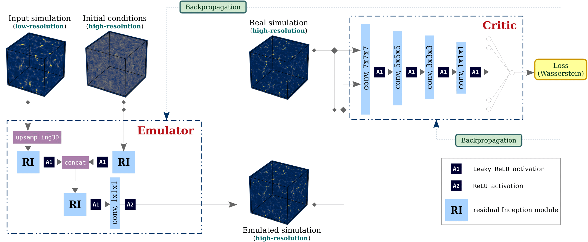

# super_resolution_emulator
**Physically maps 3D low-resolution N-body simulations to high-resolution ones using a Wasserstein generative network**

#### The network architecture, training methodology and results are detailed in:  
"*Super-resolution emulator of cosmological simulations using deep physical models*,"  
Doogesh Kodi Ramanah, Tom Charnock, Francisco Villaescusa-Navarro, Benjamin D. Wandelt [[arXiv:2001.05519]](https://arxiv.org/abs/2001.05519)

#### Note:  
1) The notebook `super_resolution_emulator.ipynb` contains an in-depth and stepwise description of the network implementation and training routine;
2) Please cite the above paper if you make use of our code.

